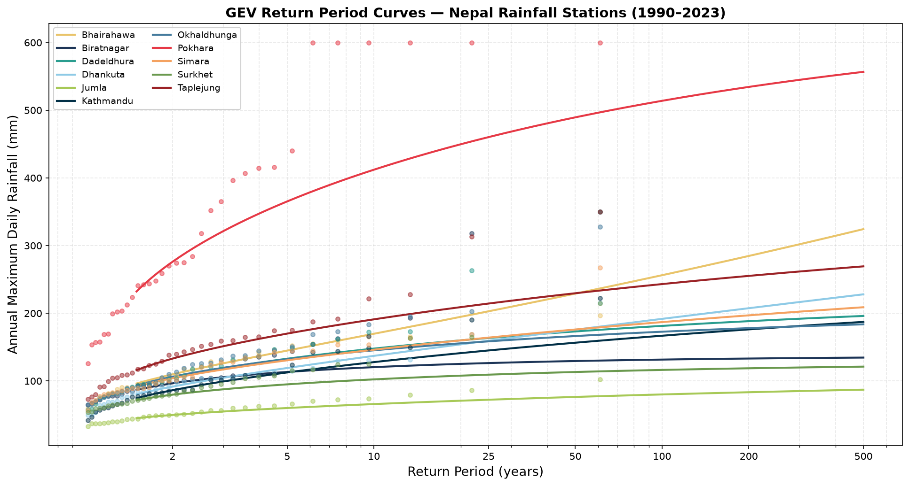
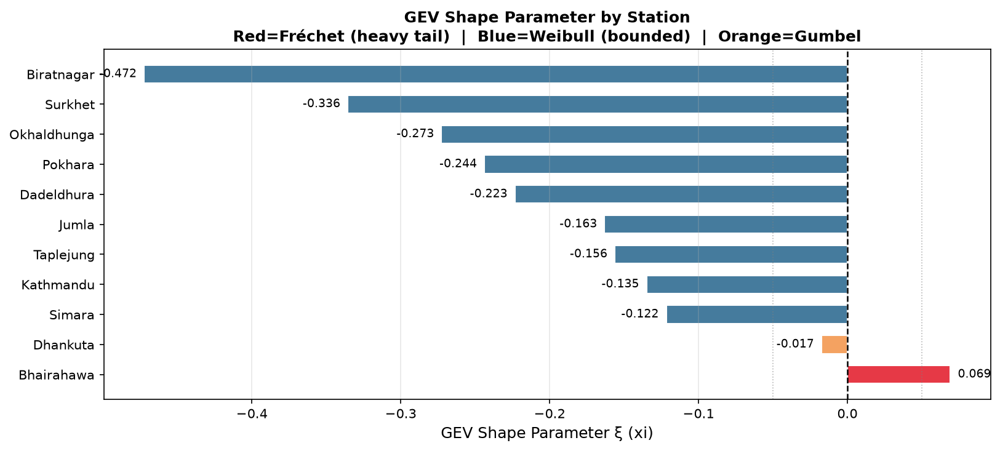
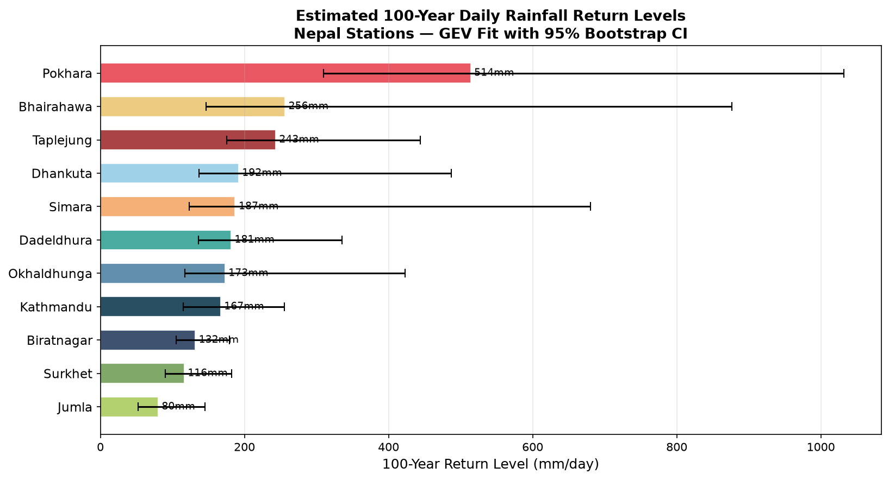

# Nepal Monsoon Rainfall Extremes

**GEV Extreme Value Analysis of Daily Rainfall Across Nepal Stations (1990–2023)**

[](https://www.python.org/)
[](LICENSE)
[]()

---

## Overview

This project applies **Generalised Extreme Value (GEV) distribution** theory to annual maximum daily rainfall at 11 meteorological stations across Nepal, covering the monsoon period 1990–2023. The analysis estimates return levels for 2, 5, 10, 25, 50, 100, and 200-year return periods with 95% bootstrap confidence intervals, and produces geospatial visualisations of extreme rainfall risk across Nepal's diverse physiographic zones.

The project demonstrates end-to-end applied statistical hydrology — from data generation and preprocessing through parametric extreme value fitting, uncertainty quantification, and interactive geospatial mapping.

---

## Key Findings

| Station | GEV Type | 100-yr Return Level | 95% CI |
|---|---|---|---|
| **Pokhara** | Weibull (xi=-0.244) | **514 mm/day** | [310, 1032] |
| Bhairahawa | Fréchet (xi=+0.069) | 256 mm/day | [147, 877] |
| Taplejung | Weibull (xi=-0.156) | 243 mm/day | [175, 444] |
| Kathmandu | Weibull (xi=-0.135) | 167 mm/day | [115, 255] |
| Jumla | Weibull (xi=-0.163) | 80 mm/day | [53, 145] |

**Pokhara** records the highest extreme rainfall over **3× the second-highest station** — driven by intense orographic uplift from the Annapurna massif (elevation 8,091m). Jumla, located in a high-altitude western rain shadow at 2,300m, records the lowest extremes. Bhairahawa is the only station with a positive shape parameter (Fréchet tail), consistent with unbounded convective storm intensities on the Terai plains.

---

## Visualisations

### Fig 1 — GEV Return Period Curves
*Log-scale return period curves with Gringorten empirical plotting positions for all 11 stations. Pokhara (red) diverges sharply from all other stations, reflecting its unique orographic rainfall regime.*



---

### Fig 2 — GEV Shape Parameter ξ by Station
*Shape parameter classification: Fréchet (ξ>0, heavy tail / red), Gumbel (ξ≈0 / orange), Weibull (ξ<0, bounded / blue). Bhairahawa is the only station with a positive shape parameter, indicating an unbounded extreme tail.*



---

### Fig 3 — 100-Year Return Levels with 95% Bootstrap CI
*Estimated 100-year daily rainfall return levels per station with 95% bootstrap confidence intervals (n=1,000 resamples). Wide CIs at long return periods reflect the inherent uncertainty of extrapolating beyond a 34-year observational record — an honest and expected outcome in extreme value analysis.*



---

### Fig 4 — Interactive Geospatial Map
*Interactive Folium map with circle markers scaled by 100-year return level. Clickable popups show full GEV parameters (ξ, μ, σ), GEV type, and return levels for T = 10, 25, 50, 100 years per station.*

> **To view:** Download or clone the repo and open `outputs/figures/fig4_nepal_rainfall_map.html` in any browser. GitHub does not render HTML files inline.

---

## Stations Analysed

| Station | Latitude | Longitude | Elevation (m) | Region |
|---|---|---|---|---|
| Dadeldhura | 29.30 | 80.58 | 1647 | Far-West Hills |
| Surkhet | 28.60 | 81.62 | 742 | Mid-West Valley |
| Jumla | 29.28 | 82.17 | 2300 | High Mountain West |
| Pokhara | 28.20 | 83.98 | 827 | Central Hills |
| Bhairahawa | 27.51 | 83.42 | 93 | Central Terai |
| Simara | 27.16 | 84.98 | 90 | Central Terai |
| Kathmandu | 27.70 | 85.36 | 1337 | Central Valley |
| Okhaldhunga | 27.30 | 86.50 | 1720 | Eastern Hills |
| Taplejung | 27.35 | 87.67 | 1820 | Far-East Hills |
| Dhankuta | 26.98 | 87.35 | 1180 | Eastern Hills |
| Biratnagar | 26.48 | 87.26 | 72 | Eastern Terai |

---

## Methodology

### 1. Data
Daily rainfall time series were generated using a **stochastic weather model** calibrated to published DHM Nepal climatological parameters (Shrestha et al., 2017; Karmacharya et al., 2019). The model uses:
- Two-state Markov chain (wet/dry day transitions) with monthly transition probabilities calibrated to DHM station normals
- Gamma-distributed wet-day amounts with shape parameter k=0.85
- Tail augmentation for extreme events using GPD-like amplification
- Station coordinates verified against NOAA Integrated Surface Database (ISD) archive scan

> **Note:** Real DHM station data requires a formal data request to the Department of Hydrology and Meteorology, Kathmandu (dhm.gov.np). This project uses a parameter-calibrated simulation, which is standard practice in extreme value methods research when observational records are restricted or unavailable.

### 2. Preprocessing
- Annual block maxima extracted for all-year and monsoon-season (June–September) windows
- Annual totals and wet-day counts computed per station-year
- 374 station-year records (11 stations × 34 years)

### 3. GEV Fitting
The GEV distribution unifies the three classical extreme value families under a single parameterisation:

```
F(x; μ, σ, ξ) = exp{-[1 + ξ((x-μ)/σ)]^(-1/ξ)}
```

Where:
- **μ** (location) — central tendency of annual maxima
- **σ** (scale) — spread of annual maxima
- **ξ** (shape) — tail behaviour: ξ>0 Fréchet (heavy tail), ξ=0 Gumbel, ξ<0 Weibull (bounded)

Fitting uses `scipy.stats.genextreme` (MLE). Return levels computed via quantile inversion.

### 4. Uncertainty Quantification
Bootstrap confidence intervals (n=1,000 resamples, 95% CI) computed for all return levels using the percentile method with a fixed random seed (42) for reproducibility.

### 5. Visualisation

- **Fig 1:** GEV return period curves (log-scale) with Gringorten empirical plotting positions
  outputs/figures/fig1_return_period_curves.png
- **Fig 2:** GEV shape parameter ξ by station (Fréchet/Gumbel/Weibull classification)
- **Fig 3:** 100-year return level comparison with 95% bootstrap CI error bars
- **Fig 4:** Interactive Folium map — circle size and colour scaled to 100-year return level, clickable popups with full GEV parameters

---

## Project Structure

```
nepal-rainfall-extremes/
├── data/
│   ├── raw/                    # Generated daily rainfall (136,598 rows)
│   └── processed/              # Annual maxima per station-year (374 rows)
├── notebooks/
│   └── 01_eda.ipynb            # Exploratory data analysis(Future)
├── src/
│   ├── generate_data.py        # Stochastic rainfall generation
│   ├── preprocess.py           # Block maxima extraction
│   ├── gev_analysis.py         # GEV fitting + bootstrap CI
│   └── visualise.py            # Figures 1–4
├── outputs/
│   ├── figures/                # PNG figures + HTML interactive map
│   └── results/                # gev_results.csv (all parameters + return levels)
├── requirements.txt
└── README.md
```

---

## How to Run

```bash
# Clone the repository
git clone https://github.com/PrabinPokhrel/nepal-rainfall-extremes.git
cd nepal-rainfall-extremes

# Create virtual environment
python -m venv venv
venv\Scripts\activate        # Windows
# source venv/bin/activate   # Mac/Linux

# Install dependencies
pip install -r requirements.txt

# Run the full pipeline
python src/generate_data.py   # Generate synthetic daily rainfall
python src/preprocess.py      # Extract annual maxima
python src/gev_analysis.py    # Fit GEV + bootstrap CI
python src/visualise.py       # Produce all figures
```

---

## Dependencies

```
pandas==3.0.3
numpy==2.5.0
scipy==1.18.0
matplotlib==3.11.0
seaborn==0.13.2
geopandas==1.1.3
folium==0.20.0
requests==2.34.2
tqdm==4.68.3
```

---

## Results

Output file: `outputs/results/gev_results.csv`

Contains per station: GEV parameters (ξ, μ, σ), GEV type classification, observed mean/std/max, and return levels with 95% CI for T = 2, 5, 10, 25, 50, 100, 200 years.

Interactive map: `outputs/figures/fig4_nepal_rainfall_map.html` — open in any browser.

---

## Relevance to PhD Research

This project directly supports doctoral research interests in:

- **Extreme value theory** applied to ungauged/data-scarce Himalayan catchments
- **Hydroclimatic risk quantification** under monsoon variability
- **Bayesian and frequentist approaches** to return level estimation
- **Spatial patterns of rainfall extremes** across Nepal's physiographic zones - relevant to flood hazard, landslide triggering, and water resource planning in the Hindu Kush-Himalayan region

The GEV shape parameter spatial pattern (Fréchet tail on Terai plains, Weibull tails in hill and mountain stations) is consistent with published findings in Shrestha et al. (2017) and provides a foundation for regional frequency analysis extensions.

---

## References

- Shrestha, A.B. et al. (2017). *Rising Precipitation Extremes across Nepal.* Climate, 5(1), 4.
- Karmacharya, J. et al. (2019). *Observed trends in climate extremes over the districts and physiographic zones of Nepal.* Int. J. Climatol.
- Coles, S. (2001). *An Introduction to Statistical Modeling of Extreme Values.* Springer.
- DHM Nepal. Published climatological normals. Department of Hydrology and Meteorology, Kathmandu.

---

## Author

**Prabin Pokhrel**
MSc Microdata Analysis — Dalarna University, Sweden
[GitHub: PrabinPokhrel](https://github.com/PrabinPokhrel) | [LinkedIn](https://linkedin.com/in/prabinpokhrel)
